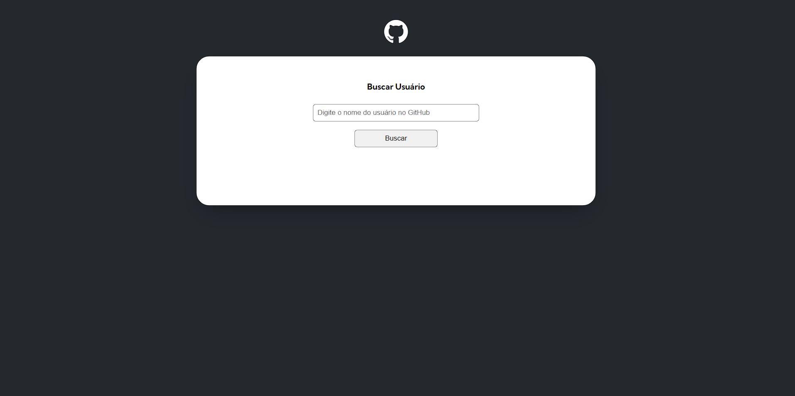
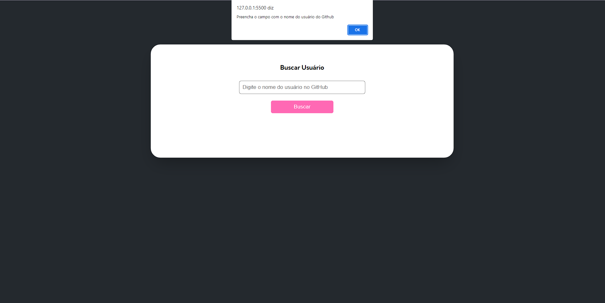
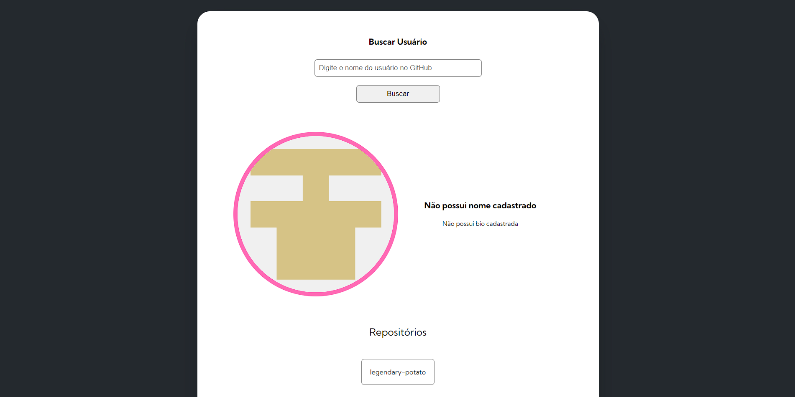
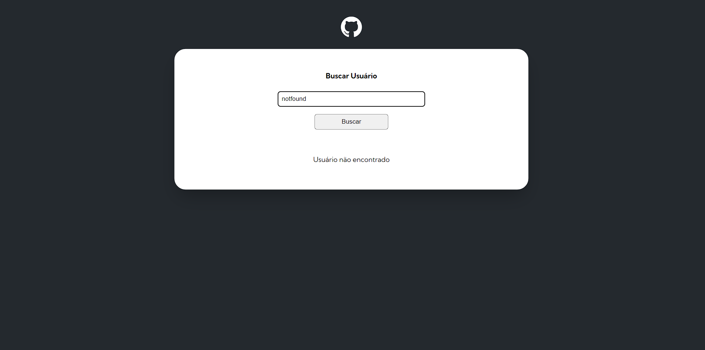

# User search on github

## Overview

### Screenshot

A page using the github API to fetch users.

### Links

- URL: [Search User]([https://wall-github-api-page.netlify.app/](https://wall-github-api-page.netlify.app/))

## My process

### Built with

- HTML5
- CSS
- Javascript
- API

### What I learned

In this project it was both a process of exercising how to use APIs in my project and a process of learning to organize and distribute functions to the SCRIPT files, to make the code easier to read.

## Author

- Github - [Wallison Viana](https://github.com/7Wall)
